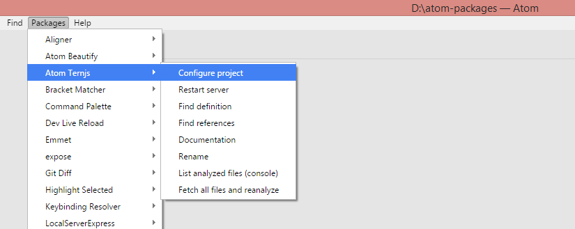

## Must have plugins for Atom (June 2016)

1. [atom-beautify](https://github.com/Glavin001/atom-beautify)

    The best beautifier for Atom with multiple language support
    `ctrl+alt+b`

2. [Linter](https://atom.io/packages/linter)

    Essential package for lint your files
    

3. [linter-eslint](https://github.com/AtomLinter/linter-eslint)

    Plugin for Linter  for JavaScript syntax.
    If you want to configure your linter-eslint you should create file .eslintrc.json, put it in the root directory of your project and make changes there.

    - [Example](./configs/.eslintrc.json):

    ```json

    {
        "env": {
            "es6": true,
            "node": true
        },
        "extends": "eslint:recommended",
        "rules": {
            "indent": [
                "error",
                4
            ],
            "no-console":"off",
            "linebreak-style": [
                "error",
                "windows"
            ],
            "quotes": [
                "error",
                "single"
            ],
            "semi": [
                "error",
                "always"
            ]
        }
    }

    ```

4. [autocomplete-project-paths](https://github.com/miya0001/autocomplete-project-paths)

    Autocomplete the paths in your project. Just type `./` and start navigating.
    

5. [emmet](https://github.com/emmetio/emmet-atom)

    [Emmet](http://emmet.io/) support for Atom.

    [emmet cheatsheet](http://docs.emmet.io/cheat-sheet/)

6. [javascript-snippets](https://github.com/zenorocha/atom-javascript-snippets)

    Cool snippets for JavaScript

    - just type `cl (press tab) => console.log(obj)`;

    

7. [script](https://github.com/rgbkrk/atom-script)

    Run code directly in Atom
    
    `ctrl+shift+b` - run the whole file

8. [Sublime-Style-Column-Selection](https://github.com/bigfive/atom-sublime-select)

    Marks selection when holding `alt` and drag with the mouse.

    

9. [sync-settings](https://github.com/atom-community/sync-settings)
    Synchronize settings, keymaps, user styles, init script, snippets and installed packages across Atom instances on different computers.

    - You have to create github token
        - [token](https://help.github.com/articles/creating-an-access-token-for-command-line-use/)
    - You have to create gist (personal) and take it's id.
        - [create gist](https://gist.github.com/)
        - `https://gist.github.com/[your username]/[gistId]`

10. [open-in-browser](https://github.com/magbicaleman/open-in-browser)
    This allows you to right click and have a menu that will open the current file in your default program.

11. [atom-ternjs](https://github.com/tststs/atom-ternjs)

    Package for intelligence. You can configure your project from Аtom packages menu (as shown below) but it is not so flexible. It is essential to configure `loadEagerly` or `dontLoad` properties if you are working on a big project. node_modules folder contains many js files and you can find yourself in trouble if you don't remove it from tern config. Plugins could be managed only in the config file for now.

    

    ```
    {
      "ecmaVersion": 6,
      "libs": [
        "browser",
        "jquery"
      ],
      "loadEagerly": [
        "path/to/your/js/**/*.js"
      ],
      "dontLoad": [
        "path/to/your/js/**/*.js"
      ],
      "plugins": {
        "complete_strings": {},
        "node": {},
        "lint": {},
        "angular": {},
        "requirejs": {},
        "modules": {},
        "es_modules": {},
        "doc_comment": {
          "fullDocs": true
        }
      }
    }
    ```

## Fancy stuff

1. [activate-power-mode](https://github.com/JoelBesada/activate-power-mode)

    

2. [file-icons](https://github.com/DanBrooker/file-icons)

    

3. [aligner](https://github.com/adrianlee44/atom-aligner)

    
